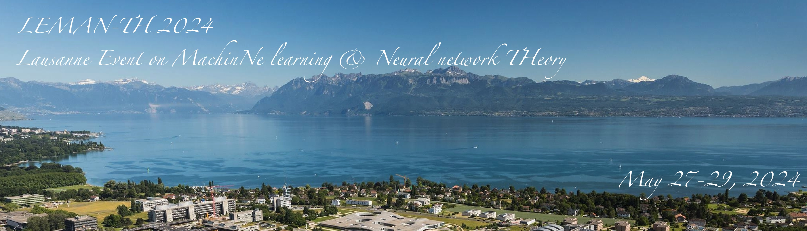

The past decade brought a revolution to machine learning: algorithms are now able to deal with tasks and amounts of data that seemed to be science fiction only a decade ago. The program will concentrate on theoretical aspect of machine learning and neural network, and their deep link with high-dimensional statistics, statistical physics, computer science.

__Organisers:__  Florent Krzakala (EPFL, IdePhics Lab.) and Bruno Loureiro (ENS, Paris)

# Schedule

# Invited speakers

Gerard Ben Arous (NYU)  
Alex Damian (Princeton)  
Nicolas Flammarion (EPFL)  
Sebastian 	Goldt	(SISSA Trieste)  
Yue	Lu	(Harvard)  
Courtney Paquette (McGill)  
Cengiz	Pehlevan (Harvard)  
Loucas Pillaud-Vivien	(Paris)  
Denny Wu (NYU)  
Lenka Zdeborova (EPFL)  

# List of Participants

# Practical informations

# Many thanks to

![Fonds National Suisse](2022-10-12-134122.670745snsf.PNG]
