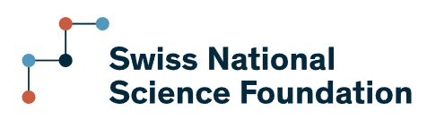
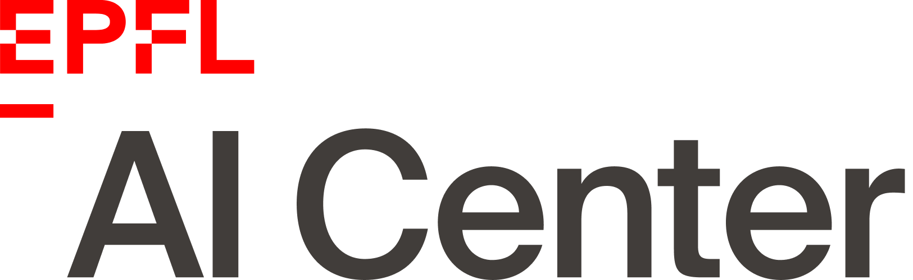

The past decade brought a revolution to machine learning: algorithms are now able to deal with tasks and amounts of data that seemed to be science fiction only a decade ago. The program will concentrate on theoretical aspect of machine learning and neural network, and their deep link with high-dimensional statistics, statistical physics, computer science.

__Organisers:__  Vittorio Erba (EPFL. Spoc lab.), Florent Krzakala (EPFL, IdePhics Lab.), and Bruno Loureiro (ENS, Paris)

# Schedule

<iframe src="https://calendar.google.com/calendar/embed?height=600&wkst=2&ctz=Europe%2FZurich&bgcolor=%23F09300&mode=WEEK&showNav=0&showDate=0&showTitle=0&showPrint=0&showCalendars=0&showTz=0&title=LEMAN-TH&src=Y2FyZ2VzZTIwMjNAZ21haWwuY29t&color=%23039BE5&dates=20240527%2F20240529" style="border:solid 1px #777" width="900" height="500" frameborder="0" scrolling="no"></iframe>

# Invited speakers

Gerard Ben Arous (NYU)  
Hugo Cui (EPFL)  
Alex Damian (Princeton)  
Yatin Dandi (EPFL)  
Elvis Dohmatob (Meta Paris)  
Ivan Dokmanic <Basel>  
Lenaic Chizat (EPFL)  
Nicolas Flammarion (EPFL)  
Cedric Gerbelot (NYU)  
Sebastian Goldt	(SISSA Trieste)  
Yue	Lu	(Harvard)  
Courtney Paquette (McGill)  
Cengiz	Pehlevan (Harvard)  
Loucas Pillaud-Vivien	(Paris)  
Federico Ricci-Tersenghi (Roma La Sapienza)  
Denny Wu (NYU)  
Lenka Zdeborova (EPFL)  
 
    
# List of Participants

TBA

# Practical informations

# Many thanks to

